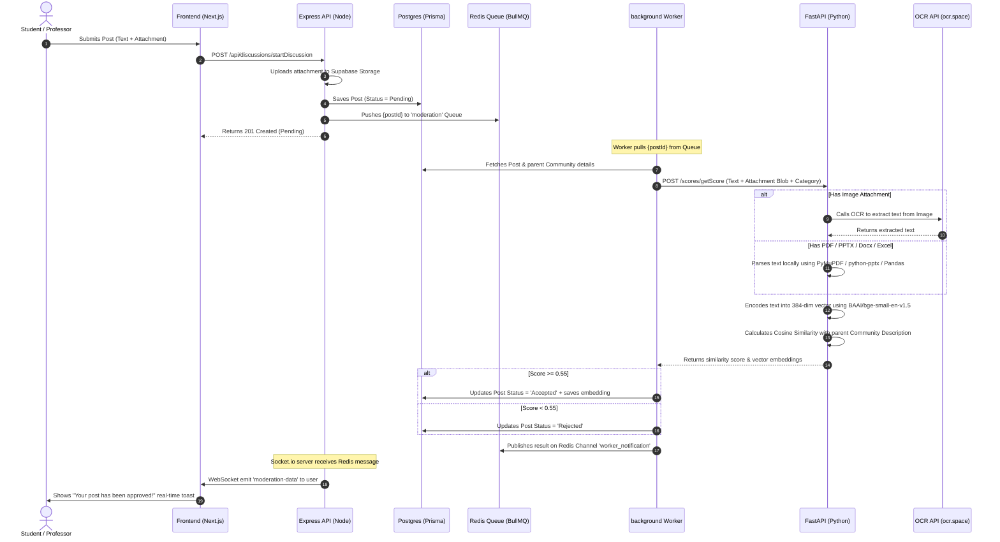

# CampNexus
> AI-Moderated, Semantic Campus Collaboration & Community Platform.

CampNexus is a campus collaboration hub designed to connect **Students, Professors, Club Heads, and Administrators**. It features real-time notifications, a custom reputation/gamification system, and a **AI-powered content moderation & semantic matching pipeline** that uses LLMs and Sentence Transformer embeddings.

---

## Features

- **Multi-Role Dashboards:** Custom user roles (`Student`, `Professor`, `ClubHead`, `Admin`) with dedicated workflows.
- **AI Content Moderation:** Automatically audits submitted posts using LLM scoring to approve, reject, or flag content in real-time.
- **Semantic Similarity Scoring:** Uses 384-dimensional dense vector embeddings (`BAAI/bge-small-en-v1.5`) to match posts and profiles to community tags via cosine similarity.
- **Universal File Parser:** Automatically extracts and analyzes text from uploaded **PDFs, Word Docs, PowerPoint Presentations, Excel Sheets, CSVs**, and **Images (using OCR)**.
- **Gamification & Reputation:** Track reputation points and reward helpful members with custom badge unlocks.
- **Real-Time Sockets:** Immediate WebSocket feedback (via Socket.io) when posts are approved or rejected by the background AI workers.

---

## Tech Stack

### Frontend
- **Framework:** Next.js (React)
- **Styling:** Tailwind CSS & Framer Motion (for smooth micro-interactions)
- **State Management:** Zustand (with persistent session middleware)
- **Icons:** Lucide React & Sonner (for real-time notifications)

### Node.js Backend (Core API)
- **Framework:** Express.js
- **Database ORM:** Prisma Client
- **Database:** PostgreSQL (with `pgvector` extension)
- **Job Queue:** BullMQ + Redis (for background workers)
- **Real-Time:** Socket.io + Redis Pub/Sub

### Python Backend (AI Engine)
- **Framework:** FastAPI
- **NLP & Embeddings:** HuggingFace `SentenceTransformers` (`BAAI/bge-small-en-v1.5`)
- **OCR Engine:** OCR Space API
- **Document Parsers:** PyMuPDF, python-pptx, python-docx, Pandas

---

## System Architecture & Data Flow



---

## Getting Started

### Prerequisites
Make sure you have the following installed on your system:
- **Node.js** (v18 or higher)
- **Python** (3.9 or higher)
- **Redis Server** (Local or Cloud instance e.g., Upstash)
- **PostgreSQL Database** (with `pgvector` support, e.g., Supabase)

---

### 1. Main API Backend Setup (`/backend`)

1. Navigate to the backend directory:
   ```bash
   cd backend
   ```
2. Install Node dependencies:
   ```bash
   npm install
   ```
3. Create a `.env` file in the root of the `backend` folder and populate it:
   ```env
   PORT=5000
   NODE_ENV=dev
   DATABASE_URL="your-postgresql-url-with-pgvector"
   DIRECT_URL="your-direct-postgresql-url"
   JWT_SECRET="your-super-secret-jwt-key"
   
   # Redis connection configuration
   REDIS_HOST="127.0.0.1"
   REDIS_PORT=6379
   REDIS_USERNAME=""
   REDIS_PASSWORD=""
   
   # Supabase details for storing attachments
   SUPABASE_URL="your-supabase-url"
   SUPABASE_KEY="your-supabase-anon-key"
   ```
4. Push the Prisma database schema and run migrations:
   ```bash
   npx prisma db push
   ```
5. Start the API server in development mode:
   ```bash
   npm run dev
   ```
6. (In a separate terminal) Start the background worker:
   ```bash
   npm run worker
   ```

---

### 2. Python AI Backend Setup (`/python-backend`)

1. Navigate to the python-backend directory:
   ```bash
   cd python-backend
   ```
2. Create and activate a Python virtual environment:
   ```bash
   python -m venv venv
   # On Windows:
   .\venv\Scripts\activate
   # On macOS/Linux:
   source venv/bin/activate
   ```
3. Install required Python packages:
   ```bash
   pip install fastapi uvicorn sentence-transformers scikit-learn requests python-multipart pymupdf python-pptx python-docx pandas openpyxl python-magic-bin
   ```
4. Create a `.env` file in the root of `python-backend`:
   ```env
   OCR_API_KEY="your-ocr-space-api-key"
   ```
5. Start the FastAPI server:
   ```bash
   uvicorn app.main:app --host 127.0.0.1 --port 8000 --reload
   ```

---

### 3. Frontend Web App Setup (`/frontend`)

1. Navigate to the frontend directory:
   ```bash
   cd frontend
   ```
2. Install Next.js dependencies:
   ```bash
   npm install
   ```
3. Start the Next.js development server:
   ```bash
   npm run dev
   ```
4. Open [http://localhost:3000](http://localhost:3000) in your browser to view the application.
